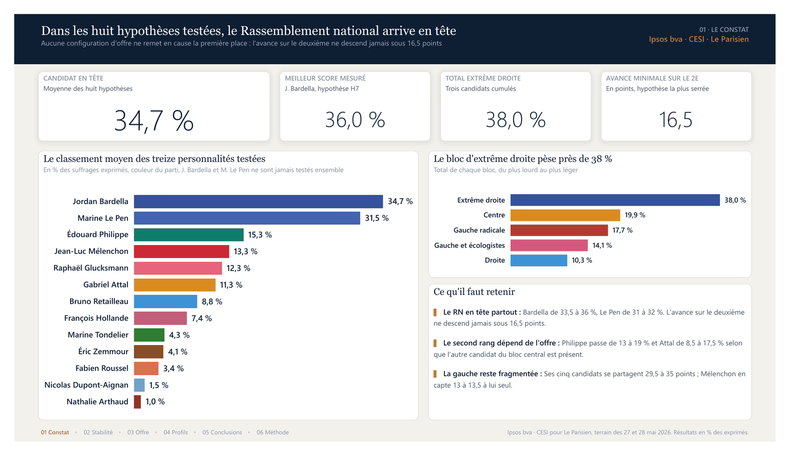
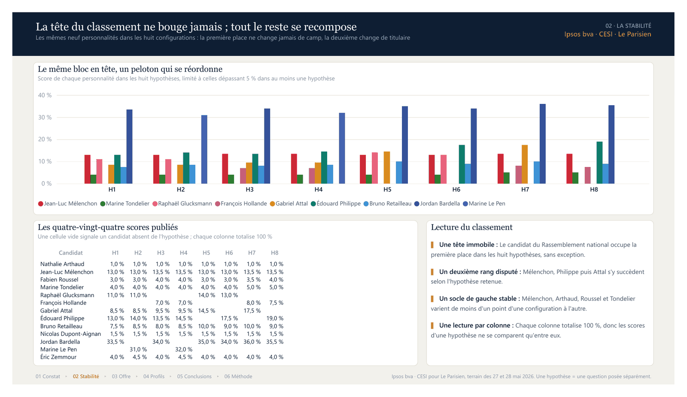
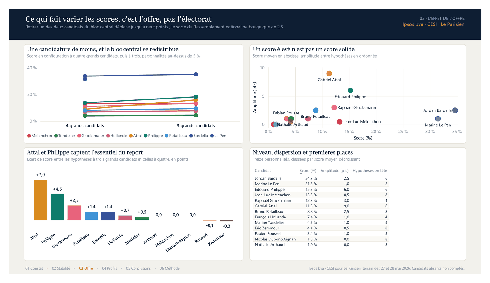
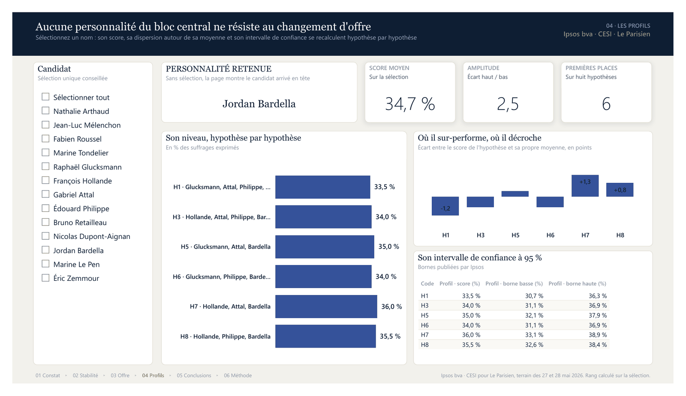
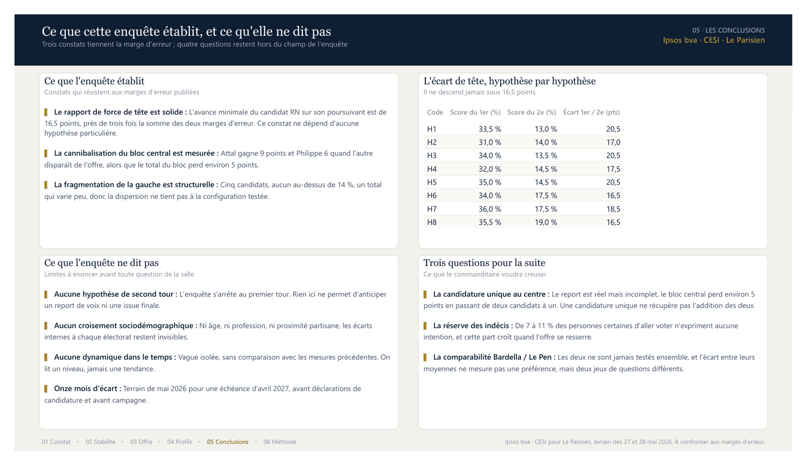
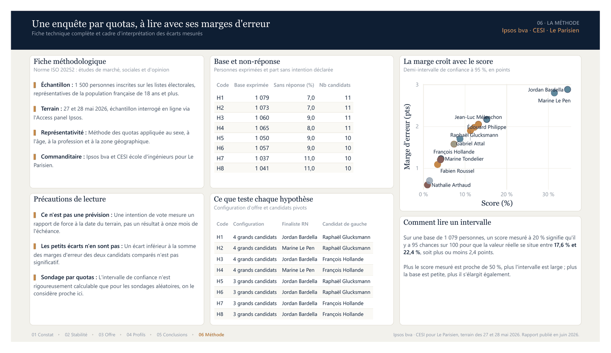

# Intentions de vote à l'élection présidentielle de 2027

Rapport Power BI complet, au format projet `.pbip`, construit sur l'enquête
**Ipsos bva et CESI école d'ingénieurs pour Le Parisien** publiée en juin 2026.
Le dépôt contient le rapport, le modèle sémantique, les données et le générateur
Python qui produit l'ensemble.

Les libellés du rapport sont en français : noms de pages, titres de visuels,
en-têtes de colonnes et libellés d'axes. Cette documentation suit la même langue.

**[Voir les six pages en ligne](https://abdoulhamiddiallo.github.io/presidentielle-2027-powerbi/)**
· [Télécharger le rapport en PDF](docs/rapport-presidentielle-2027.pdf)



---

## 1. Ce que fait le rapport

L'enquête ne mesure pas une intention de vote, elle en mesure huit. L'institut a
posé la question dans huit configurations d'offre différentes, en faisant varier
le candidat du Rassemblement national (Jordan Bardella ou Marine Le Pen), le
candidat de gauche (Raphaël Glucksmann ou François Hollande) et la présence
simultanée ou non des deux personnalités du bloc central (Gabriel Attal et
Édouard Philippe).

Lire ces huit colonnes séparément ne dit rien. Le rapport répond à une question
précise : **qu'est-ce qui reste vrai quelle que soit l'hypothèse testée, et
qu'est-ce qui dépend uniquement de la configuration ?**

Trois résultats structurent la démonstration :

1. Le candidat du Rassemblement national arrive en tête dans les huit
   hypothèses, avec une avance minimale de 16,5 points sur le deuxième, soit
   près de trois fois la somme des deux marges d'erreur.
2. La deuxième place change de titulaire selon l'hypothèse : Mélenchon,
   Philippe ou Attal s'y succèdent.
3. Retirer une des deux personnalités du bloc central déplace jusqu'à neuf
   points, alors que le socle du Rassemblement national ne varie que de 2,5.

Le rapport est donc construit comme une démonstration en six étapes, pas comme
une collection de graphiques.

Documentation détaillée : [le modèle de données](docs/modele-de-donnees.md),
[les mesures DAX](docs/mesures-dax.md),
[l'inventaire des pages](docs/pages-du-rapport.md),
[les choix de conception](docs/choix-de-conception.md).

---

## 2. Les pages et ce qu'elles montrent

Chaque page porte un titre affirmatif : le titre énonce la conclusion, les
visuels l'établissent. Un fil de progression en bas de page rappelle l'étape
courante. Le rapport compte six pages visibles, soixante-deux visuels et une
page d'info-bulle.

### 01 · Le constat

*Dans les huit hypothèses testées, le Rassemblement national arrive en tête.*

Quatre indicateurs de cadrage (candidat en tête, meilleur score mesuré, total
extrême droite, avance minimale sur le deuxième), le classement moyen des treize
personnalités testées en barres horizontales aux couleurs des partis, le poids
des cinq blocs politiques classés du plus lourd au plus léger, et trois points de
lecture. La capture figure en tête de ce fichier.

### 02 · La stabilité du classement

*La tête du classement ne bouge jamais, tout le reste se recompose.*

Un graphique à colonnes groupées confronte les neuf personnalités qui dépassent
5 % dans au moins une hypothèse, hypothèse par hypothèse. Une matrice affiche
les quatre-vingt-quatre scores publiés, avec mise en forme conditionnelle par
intensité : une cellule vide signale un candidat absent de l'hypothèse.



### 03 · L'effet de l'offre

*Ce qui fait varier les scores, c'est l'offre, pas l'électorat.*

Un graphique de pente compare les configurations à quatre grands candidats et à
trois. Un nuage de points croise le score moyen et l'amplitude entre hypothèses,
ce qui sépare les scores élevés des scores solides. Un graphique à colonnes
mesure l'effet de l'offre resserrée candidat par candidat. Un tableau récapitule
niveau, dispersion et nombre de premières places.



### 04 · Les profils

*Aucune personnalité du bloc central ne résiste au changement d'offre.*

Page pilotée par un segment de sélection du candidat. Quatre cartes (personnalité
retenue, score moyen, amplitude, premières places), son niveau hypothèse par
hypothèse, ses écarts à sa propre moyenne, et son intervalle de confiance à 95 %
détaillé. Toutes les mesures de cette page retombent sur Jordan Bardella quand
aucune sélection n'est active, afin que la page ne soit jamais vide.



### 05 · Les conclusions

*Ce que cette enquête établit, et ce qu'elle ne dit pas.*

Trois constats qui tiennent la marge d'erreur, quatre questions hors du champ de
l'enquête, trois questions ouvertes pour la suite, et un tableau de l'écart de
tête hypothèse par hypothèse.



### 06 · La méthode

*Une enquête par quotas, à lire avec ses marges d'erreur.*

Fiche technique complète, base et non-réponse par hypothèse, contenu de chaque
hypothèse, explication de l'intervalle de confiance et nuage de points de la
marge d'erreur en fonction du score.



### Info-bulle · profil candidat

Page d'info-bulle de 320 x 240 pixels, masquée en mode lecture, rattachée aux
graphiques du classement. Elle affiche le score moyen, l'amplitude, le nombre de
premières places et le profil par hypothèse du candidat survolé.

Le détail visuel par visuel, avec les positions et les tailles, figure dans
[`docs/pages-du-rapport.md`](docs/pages-du-rapport.md).

---

## 3. Le modèle de données

Schéma en étoile : une table de faits, deux dimensions, une table de mesures
sans données.

```text
Candidats (13 lignes)          Hypotheses (8 lignes)
       |                              |
       | 1                            | 1
       |                              |
       *                              *
            Intentions (84 lignes)

            Mesures (table de calcul, aucune colonne)
```

### Tables

| Table | Rôle | Lignes | Colonnes |
|---|---|---|---|
| `Candidats` | Référentiel des personnalités testées | 13 | `Candidat`, `Nom court`, `Parti`, `Bloc`, `OrdreBloc`, `Ordre`, `Couleur`, `CouleurBloc` |
| `Hypotheses` | Les huit configurations d'offre | 8 | `Code`, `Hypothèse`, `Intitulé`, `Base exprimée`, `Sans réponse (%)`, `Nb candidats`, `Finaliste RN`, `Candidat de gauche`, `Configuration`, `OrdreConfig`, `Ordre` |
| `Intentions` | Table de faits, un score par candidat et par hypothèse | 84 | `Code`, `Candidat`, `Score`, `Marge` |
| `Mesures` | Conteneur de mesures, aucune donnée | 0 | aucune |

`Couleur` et `CouleurBloc` portent le code hexadécimal de la formation
politique. Elles alimentent la mise en forme conditionnelle des visuels, ce qui
évite de figer les couleurs visuel par visuel.

`Ordre` et `OrdreBloc` servent de colonnes de tri : les candidats se présentent
de la gauche vers la droite de l'échiquier politique, pas par ordre
alphabétique.

### Relations

| De | Vers | Cardinalité | Sens du filtre |
|---|---|---|---|
| `Intentions[Candidat]` | `Candidats[Candidat]` | plusieurs vers un | simple |
| `Intentions[Code]` | `Hypotheses[Code]` | plusieurs vers un | simple |

### Mesures

Quarante et une mesures, rangées en huit dossiers d'affichage.

| Dossier | Contenu |
|---|---|
| 01 Intentions de vote | `Score (%)`, `Score max (%)`, `Score min (%)`, `Amplitude (pts)`, `Meilleur score mesuré (%)`, `Score au classement (%)` |
| 02 Précision statistique | `Marge d’erreur (pts)`, `Borne basse (%)`, `Borne haute (%)`, `Base moyenne`, `Sans intention exprimée (%)` |
| 03 Cadrage | `Nb hypothèses`, `Nb candidats testés`, `Rang`, `Rang au classement`, `Hypothèses en tête` |
| 04 Écarts | `Score du 1er (%)`, `Score du 2e (%)`, `Écart 1er / 2e (pts)`, `Écart au 1er (pts)`, `Écart minimal 1er / 2e (pts)`, `Effet de l’offre resserrée (pts)` |
| 05 Blocs politiques | `Total extrême droite (%)`, `Total gauche (%)`, `Total centre et droite (%)`, `Poids dans le bloc (%)` |
| 06 Titres dynamiques | `Hypothèse sélectionnée`, `Candidat sélectionné`, `Note de lecture`, `Étiquette avance` |
| 07 Mise en forme | `Couleur du candidat`, `Couleur du bloc` |
| 08 Page profil | `Candidat de référence` et les huit mesures `Profil · ...` de la page 04 |

La mesure fondatrice est `Score (%)`. Elle moyenne le score sur les hypothèses
du contexte courant au lieu de les additionner :

```dax
Score (%) =
DIVIDE (
    AVERAGEX (
        VALUES ( Hypotheses[Code] ),
        CALCULATE ( SUM ( Intentions[Score] ) )
    ),
    100
)
```

Conséquence : la mesure rend le score exact quand une seule hypothèse est dans
le contexte, et la moyenne des scénarios sinon. Une somme brute aurait produit
des totaux à 800 %, sans aucun sens.

`Score au classement (%)` renvoie `BLANK` sous 5 % du maximum. Elle allège les
visuels à série, qui ne montrent alors que les neuf personnalités réellement
lisibles.

`Candidat de référence` retient la sélection du segment de la page 04 et retombe
sur Jordan Bardella en l'absence de sélection. Les mesures `Profil · ...`
s'appuient dessus par une variable, jamais par un appel de mesure dans un
prédicat `CALCULATE`, ce que DAX interdit.

Le détail des quarante et une mesures figure dans
[`docs/mesures-dax.md`](docs/mesures-dax.md), celui des tables, des colonnes et
de leur alimentation dans
[`docs/modele-de-donnees.md`](docs/modele-de-donnees.md).

---

## 4. La source des données

**Les données ne sont pas simulées.** Les quatre-vingt-quatre scores, les marges
d'erreur, les bases et les taux de non-réponse proviennent du rapport public de
l'enquête, saisis à l'identique.

| Élément | Valeur |
|---|---|
| Institut | Ipsos bva |
| Commanditaires | CESI école d'ingénieurs et Le Parisien |
| Terrain | 27 et 28 mai 2026 |
| Publication | juin 2026 |
| Échantillon | 1 500 personnes inscrites sur les listes électorales, représentatives de la population française de 18 ans et plus |
| Mode de recueil | questionnaire auto-administré en ligne, Access panel de l'institut |
| Méthode | quotas sur le sexe, l'âge, la profession et la zone géographique |
| Norme | ISO 20252 |
| Base exprimée | de 1 037 à 1 079 personnes selon l'hypothèse |
| Sans intention exprimée | de 7 à 11 % des personnes certaines d'aller voter |

Les scores sont exprimés en pourcentage des suffrages exprimés. Chaque hypothèse
totalise 100 % : le fichier `pdata.py` contient un contrôle qui vérifie cette
somme pour les huit hypothèses et interrompt la génération si elle n'est pas
atteinte.

Deux précautions valent d'être répétées, elles figurent aussi sur la page 06 du
rapport :

- Jordan Bardella et Marine Le Pen ne sont jamais testés dans la même
  hypothèse. L'écart entre leurs moyennes ne mesure pas une préférence des
  personnes interrogées, il compare deux jeux de questions distincts.
- Un écart inférieur à la somme des marges d'erreur des deux candidats comparés
  n'est pas significatif.

Les droits sur les données d'enquête appartiennent à leurs auteurs. Elles sont
reprises ici à des fins d'analyse et de démonstration technique, avec citation
de la source.

---

## 5. Comment ouvrir le projet

### Prérequis

- Power BI Desktop, version de septembre 2024 ou plus récente.
- L'option **Fichier > Options > Fonctionnalités en préversion > Format de
  rapport amélioré (PBIR)** doit être activée. Le rapport est enregistré dans ce
  format, sans quoi les pages ne s'ouvrent pas.
- Python 3.9 ou plus récent, uniquement pour regénérer le projet.

### Ouvrir

1. Clonez ou téléchargez le dépôt.
2. Ouvrez `Presidentielle 2027.pbip` dans Power BI Desktop.
3. Ouvrez **Transformer les données > Gérer les paramètres** et donnez au
   paramètre `CheminDonnees` le chemin complet du dossier
   `Presidentielle 2027 - Donnees` de votre copie locale, séparateur final
   compris. Exemple :
   `C:\Projets\Presidentielle 2027\Presidentielle 2027 - Donnees\`
4. Actualisez. Les trois tables se chargent depuis les fichiers CSV, encodés en
   UTF-8 avec BOM et séparés par des points-virgules.

La valeur livrée du paramètre est un chemin d'exemple. C'est la seule valeur à
adapter après un clone.

### Regénérer le projet

Le rapport n'est pas dessiné à la main : il est produit par le générateur
Python. Modifier un titre, une couleur ou une mesure se fait dans le code, puis
on regénère.

```text
cd "Presidentielle 2027 - Generateur"
python pbuild.py "<dossier de destination>" "<chemin du thème de base>" "<racine Windows du projet>"
```

Les deuxième et troisième arguments sont facultatifs. Le troisième sert à
inscrire un chemin Windows dans la valeur par défaut du paramètre
`CheminDonnees` quand la génération a lieu sur une autre machine que celle qui
ouvrira le rapport.

Un aperçu HTML de la mise en page peut être produit sans Power BI :

```text
python preview.py "<dossier du projet>" apercu.html
```

Cet aperçu est un outil de contrôle de la mise en page. Il reconstitue les
cadres, les titres et les proportions, pas le rendu exact des graphiques.

---

## 6. Structure des dossiers

```text
presidentielle-2027-powerbi/
├── README.md
├── LICENSE
├── .gitignore
├── .markdownlint.json                       règles de mise en forme de la documentation
├── .github/workflows/controles.yml          régénération et contrôles automatiques
├── docs/
│   ├── index.html                page publiée, les six pages en images
│   ├── images/                   une capture par page du rapport
│   ├── rapport-presidentielle-2027.pdf   export des six pages
│   ├── modele-de-donnees.md      tables, colonnes, relations, tri et couleurs
│   ├── mesures-dax.md            les 41 mesures, code et rôle
│   ├── pages-du-rapport.md       inventaire visuel par visuel
│   └── choix-de-conception.md    partis pris de mise en forme et pièges évités
├── Presidentielle 2027.pbip                 point d'entrée du projet
├── Presidentielle 2027.Report/              définition du rapport, format PBIR
│   ├── definition/
│   │   ├── pages/                           une page par dossier, un visuel par dossier
│   │   ├── pages/pages.json                 ordre des pages et page active
│   │   ├── report.json
│   │   └── version.json
│   └── StaticResources/                     thème du rapport
├── Presidentielle 2027.SemanticModel/       modèle sémantique, format TMDL
│   └── definition/
│       ├── expressions.tmdl                 paramètre CheminDonnees
│       ├── model.tmdl
│       ├── relationships.tmdl
│       ├── cultures/fr-FR.tmdl
│       └── tables/                          Candidats, Hypotheses, Intentions, Mesures
├── Presidentielle 2027 - Donnees/           les trois fichiers CSV sources
└── Presidentielle 2027 - Generateur/        le code qui produit tout ce qui précède
    ├── pdata.py          données extraites du rapport publié, source unique de vérité
    ├── pbuild_core.py    moteur de rendu PBIR, jetons de design, fabriques de visuels
    ├── pbuild_model.py   écriture des CSV et génération du modèle TMDL
    ├── pbuild_pages.py   composition des six pages et de l'info-bulle
    ├── pbuild.py         orchestrateur, thème et contrôles de cohérence
    └── preview.py        aperçu HTML de la mise en page
```

---

## 7. Licence

Le code du générateur et la définition du rapport sont publiés sous licence MIT,
voir le fichier `LICENSE`.

Les données d'enquête restent la propriété de leurs auteurs, Ipsos bva, le CESI
école d'ingénieurs et Le Parisien. Elles sont citées, elles ne sont pas
concédées. Le rapport source n'est pas redistribué dans ce dépôt : seules les
valeurs publiées y sont reprises, avec mention de leur origine.

Les partis pris de conception et les pièges rencontrés sont documentés dans
[`docs/choix-de-conception.md`](docs/choix-de-conception.md).
